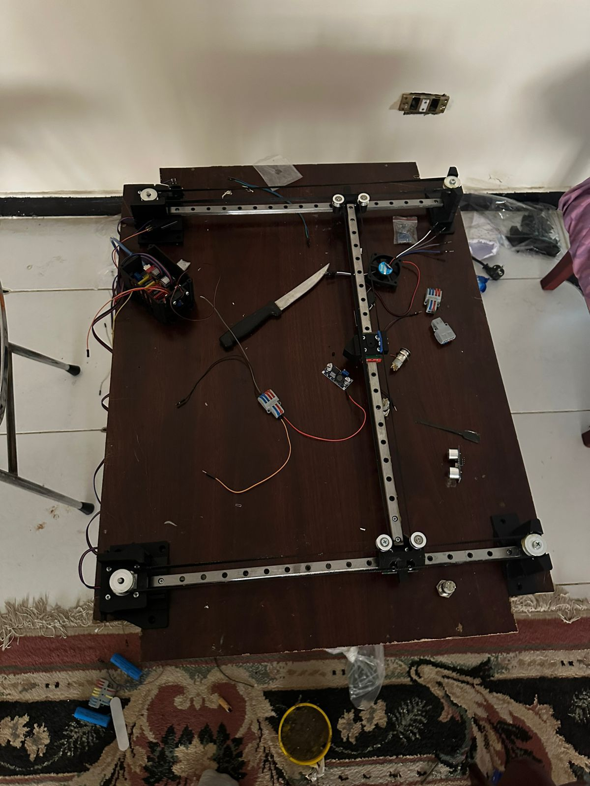
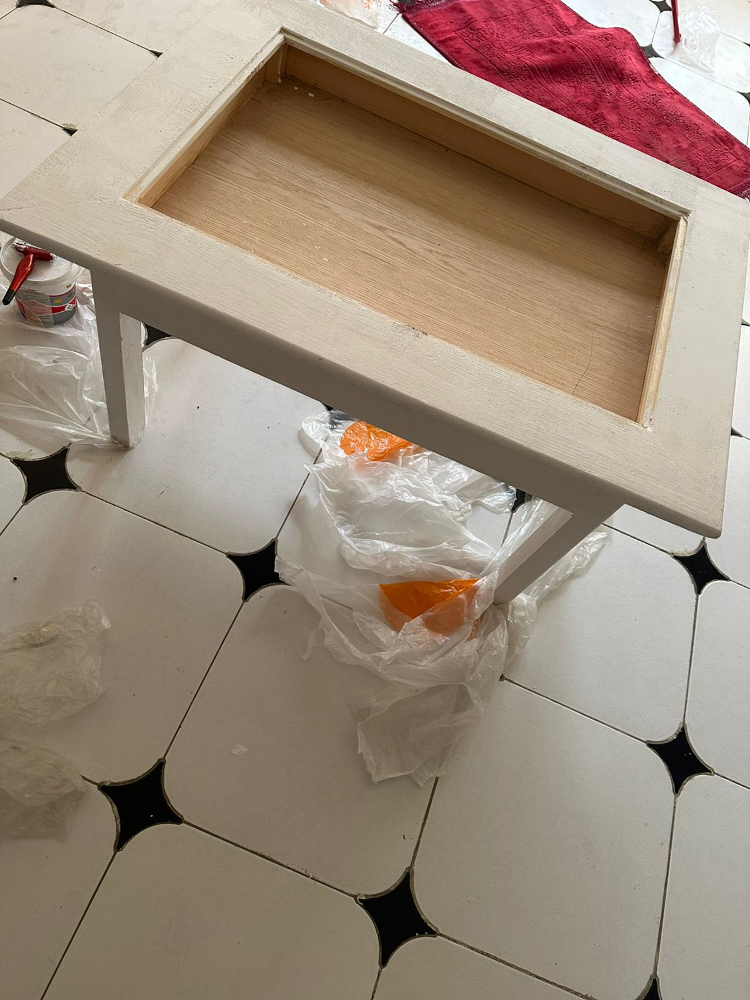
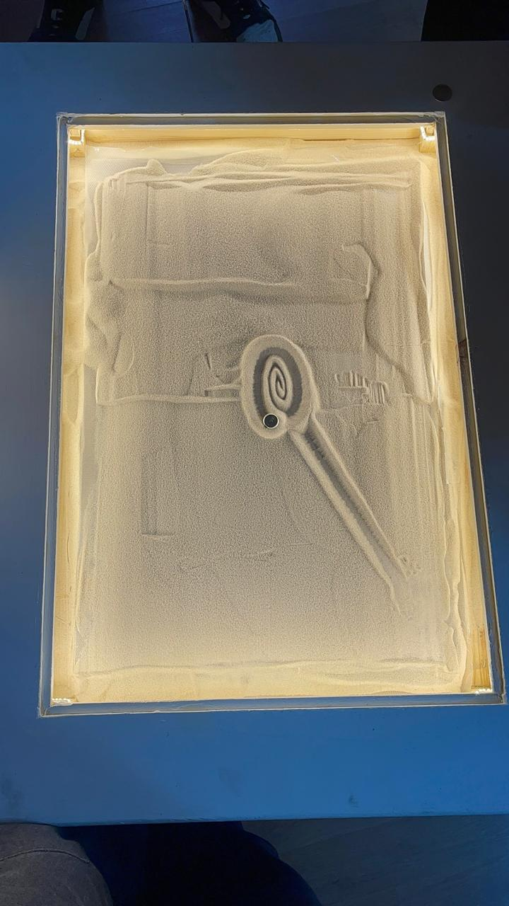

# 🏖️ CNC Sand Plotter
 
A CoreXY magnet-driven sand plotter that draws patterns in sand using a stepper-motor-controlled magnet beneath a sand-filled acrylic tray. The magnet moves a steel ball through the sand from below, creating smooth, precise geometric and artistic patterns.
 
---
 
## 📸 Preview
 
| Mechanism | Table Overview |
|----------|-----------------|
|  |  |

| Top View | 
|----------|
|  | 

| Circuit Diagram | 
|----------|
| .png) | 


 # 🎥 Demo Videos

This section includes demonstration videos showing the CNC sand plotter executing different G-code patterns.

---

## 🔷 Rectangle Plot (Basic Test)

This test demonstrates basic motion control and accuracy using manually written G-code.

* Validates X-Y axis calibration
* Shows straight-line motion and corner transitions

▶️ Video:
[Watch Rectangle Plot](https://youtube.com/shorts/vtb_804KbJM?feature=share)

## 🧠 Notes

* All patterns are executed using GRBL firmware on Arduino
* G-code is sent via Universal G-code Sender (UGS)
* Feed rates and motion parameters were tuned for smooth sand plotting


## 🌀 Spiral / Pattern Plot (Advanced Test)

This test demonstrates the execution of complex toolpaths generated using an external CAM tool.

* Shows smooth continuous motion
* Validates system performance for intricate designs
* Demonstrates real application capability

▶️ Video:
[Watch Pattern Plot](https://youtube.com/shorts/-A5MgVSQe2M?feature=share)

---


## 🧠 Notes

* All patterns are executed using GRBL firmware on Arduino
* G-code is sent via Universal G-code Sender (UGS)
* Feed rates and motion parameters were tuned for smooth sand plotting
---
 
## ✨ Features
 
- CoreXY belt-driven motion system for fast, smooth diagonal movement
- Archimedean spiral + rectangle GCode patterns included
- Custom Arduino firmware with built-in CoreXY kinematics
- GRBL-compatible configuration
- Python GCode generator script — tweak and regenerate patterns instantly
- LED-backlit sand tray for beautiful visual effect
---
 
## 🗂️ Repository Structure
 
```
sand-plotter/
│
├── firmware/
│   └── sand_plotter.ino        # Arduino sketch (CoreXY kinematics + GCode parser)
│
├── config/
│   └── grbl_config.txt         # GRBL $-settings — paste into Serial console
│
├── gcode/
│   ├── rectangle.gcode         # Simple rectangle border pattern
│   └── sand_pattern.gcode      # Rectangle + lollipop spiral pattern
│
├── scripts/
│   └── generate_gcode.py       # Python script to generate custom patterns
│
├── images/
│   └── sand_plotter_top_view.jpeg
│
└── README.md
```
 
---
 
## 🛠️ Hardware Requirements
 
| Component | Details |
|-----------|---------|
| Microcontroller | Arduino UNO or Nano |
| Stepper Motors | 2× NEMA 17 (1.8°, any torque rating) |
| Motor Drivers | 2× A4988 or DRV8825 |
| Frame | CoreXY belt system (GT2 belt + 20-tooth pulleys) |
| Power Supply | 12V 2A minimum |
| Endstops | 2× mechanical or optical (X and Y) |
| Sand Tray | Acrylic or wooden box filled with fine sand |
| Magnet | 20–30mm neodymium disc magnet (under tray) |
| Steel Ball | 10–20mm ball bearing (on top of sand) |
| Lighting (optional) | LED strip around tray edges for glow effect |
 
---
 
## ⚡ Wiring Diagram
 
```
Arduino UNO
───────────────────────────────────
Pin 2  → Motor A STEP   (Left stepper)
Pin 3  → Motor A DIR
Pin 4  → Motor B STEP   (Right stepper)
Pin 5  → Motor B DIR
Pin 8  → ENABLE (both drivers, active LOW)
Pin 9  → X Endstop (INPUT_PULLUP)
Pin 10 → Y Endstop (INPUT_PULLUP)
5V     → Driver VDD / Logic
GND    → Common ground
12V    → Driver VMOT (from power supply)
```
 
> ⚠️ **Always connect VMOT before enabling the drivers. Never disconnect a stepper while powered.**
 
---
 
## 📥 Installation & Setup
 
### 1. Flash the Arduino Firmware
 
1. Install [Arduino IDE](https://www.arduino.cc/en/software)
2. Install the **AccelStepper** library:
   - `Sketch → Include Library → Manage Libraries`
   - Search **AccelStepper** → Install
3. Open `firmware/sand_plotter.ino`
4. Select your board: `Tools → Board → Arduino UNO`
5. Select your port and click **Upload**
---
 
### 2. Configure GRBL (Optional — if using GRBL instead of custom firmware)
 
1. Flash [GRBL 1.1f](https://github.com/gnea/grbl/releases) to your Arduino
2. Open a Serial Monitor at **115200 baud**
3. Copy and paste the contents of `config/grbl_config.txt` line by line
4. Run `$$` to verify settings were saved
> **Note:** GRBL does not natively support CoreXY kinematics. The custom `sand_plotter.ino` firmware handles CoreXY math internally. Use GRBL only if your belt layout drives X and Y axes independently.
 
---
 
### 3. Tune Steps Per Millimeter
 
Edit this value in `sand_plotter.ino`:
 
```cpp
#define STEPS_PER_MM 80.0f
```
 
**Formula:**
 
```
steps/mm = (motor steps/rev × microstep divisor) ÷ (pulley teeth × belt pitch)
 
Example (GT2 belt, 20-tooth pulley, 1/16 microstepping):
= (200 × 16) ÷ (20 × 2) = 80 steps/mm
```
 
Verify by commanding `G1 X100` and measuring actual movement with a ruler. Adjust until accurate.
 
---
 
### 4. Send GCode
 
Use any of these GCode senders:
 
| Software | Platform | Link |
|----------|----------|------|
| Universal Gcode Sender (UGS) | Windows/Mac/Linux | [winder.github.io/ugs_platform](https://winder.github.io/ugs_platform/) |
| bCNC | Windows/Mac/Linux | [github.com/vlachoudis/bCNC](https://github.com/vlachoudis/bCNC) |
| Candle | Windows | [github.com/Denvi/Candle](https://github.com/Denvi/Candle) |
| Arduino Serial Monitor | Any | Built into Arduino IDE |
 
**Steps:**
1. Connect Arduino via USB
2. Open your GCode sender, connect at **115200 baud**
3. Home the machine: send `G28` or `$H`
4. Load a `.gcode` file from the `gcode/` folder
5. Click **Send** / **Run**
---
 
## 🐍 Generating Custom Patterns
 
Run the Python generator to create your own GCode:
 
```bash
python3 scripts/generate_gcode.py
```
 
This produces `sand_pattern.gcode` with a **rectangle border → lollipop spiral**.
 
**Customise the pattern** by editing the settings at the top of `generate_gcode.py`:
 
```python
BED_W        = 280.0   # mm — bed width
BED_H        = 380.0   # mm — bed height
MARGIN       = 12.0    # mm — inset from edge
FEED_DRAW    = 1200    # mm/min — drawing speed
 
SPIRAL_CX    = 118.0   # spiral center X
SPIRAL_CY    = 197.0   # spiral center Y
SPIRAL_R_MAX = 55.0    # outer radius
SPIRAL_TURNS = 3.5     # number of revolutions
```
 
---
 
## 📄 GCode Patterns Included
 
### `rectangle.gcode`
Draws a simple rectangle border 12mm inset from the bed edges.
 
```
G0 F4000 X12 Y12
G1 F1200 X268 Y12
G1       X268 Y368
G1       X12  Y368
G1       X12  Y12
```
 
---
 
### `sand_pattern.gcode`
Full pattern from the project photo:
1. Rectangle border
2. Diagonal stick line
3. 3.5-turn inward Archimedean spiral (lollipop head)
---
 
## 🔧 Troubleshooting
 
| Problem | Solution |
|---------|----------|
| Motor runs in wrong direction | Change `$3` bitmask in GRBL, or flip DIR wire |
| Steps/mm inaccurate | Measure actual vs commanded, recalculate with formula |
| `ALARM:1` on startup | Send `$X` to clear alarm, then `$H` to home |
| Homing won't stop | Check endstop wiring; try `$5=1` to invert logic |
| Magnet loses the ball | Reduce `FEED_DRAW` speed; increase magnet strength |
| Jittery movement | Lower acceleration: `$120` / `$121` in GRBL or `ACCELERATION` in firmware |
 
---
 
## 🙏 Acknowledgements
 
- Inspired by [Sisyphus](https://sisyphus-industries.com/) kinetic sand tables
- CoreXY mechanism design community
- [GRBL](https://github.com/gnea/grbl) open-source CNC firmware
- [AccelStepper](https://www.airspayce.com/mikem/arduino/AccelStepper/) library by Mike McCauley
---
 
## 📜 License
 
MIT License — free to use, modify, and share. See [LICENSE](LICENSE) for details.
 
---
 
*Built with ☕ and way too much fine sand.*
